# Advanced Lane Finding

## 0. The Project

The goals / steps of this project are the following:

* Compute the camera calibration matrix and distortion coefficients given a set of chessboard images.
* Apply a distortion correction to raw images.
* Use color transforms, gradients, etc., to create a thresholded binary image.
* Apply a perspective transform to rectify binary image ("birds-eye view").
* Detect lane pixels and fit to find the lane boundary.
* Determine the curvature of the lane and vehicle position with respect to center.
* Warp the detected lane boundaries back onto the original image.
* Output visual display of the lane boundaries and numerical estimation of lane curvature and vehicle position.
* [Rubric](https://review.udacity.com/#!/rubrics/571/view) for the project.

## 1. Camera Calibration
The camera functionality was abstracted to a class to handle the calibration and perspective transformations of images for this project. For an overview of the code you can view it in main/camera.py. When the Camera class is instantiated the constructor loads a pre-determined image from the 'camera_cal' folder to load the distortion parameters. Since the camera parameters do not change between sessions they are saved locally using a pickle database once calculated. However, if the database file is not present then all the images from the 'camera_cal' folder are loaded and run through the 'cv2.findChessboardCorners()' function to characterize the lense distortion on the camera.

 
 

Once the corners of the chessboard have been determined, then the distortion on can be applied to an image using the OpenCV 'cv2.calibrateCamera()' function to calculate the parameters (ret, mtx, dist, rvecs, tvecs). The results are then saved using pickle. The original image (left) and is then corrected for distortion (right) using 'cv2.undistort()'.

 
 

The camera class has two functions for applying perspective transforms to images to either warp or restore their original shape. These functions will be discussed later in this document.

## 2. Pipeline (Single Images)
The main pipeline for processing the images resides in the Lane class (main/lane.py) which was developed for managing the lane line and camera classes. To augment a lane onto an image, create an instance of class Lane() and pass an RGB image in as an argument to the process() function in the Lane class. This section will explain the steps in the process function.

### 2.1 Apply Thresholds

#### 2.1.1 Magnitude Threshold
Using the Sobel function from OpenCV the change in gradient in both the x and y axes produce binary images indicating the regions of strong gradients which is useful for identifying colored lane lines on a the road. To limit noise on for the Sobel function the RGB image is converted to grayscale and then the magnitude gradient is calculated from the x and y Sobel images by square rooting the sum of the squares of the images. 

 
 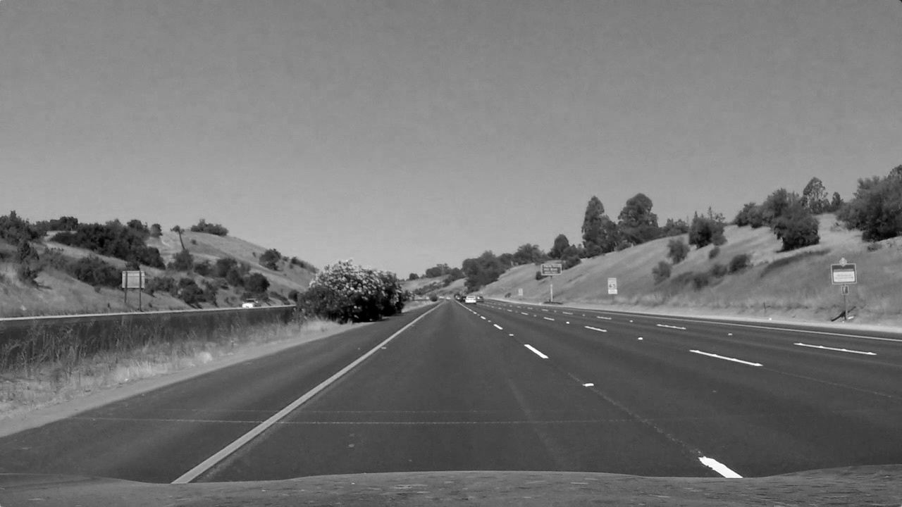
 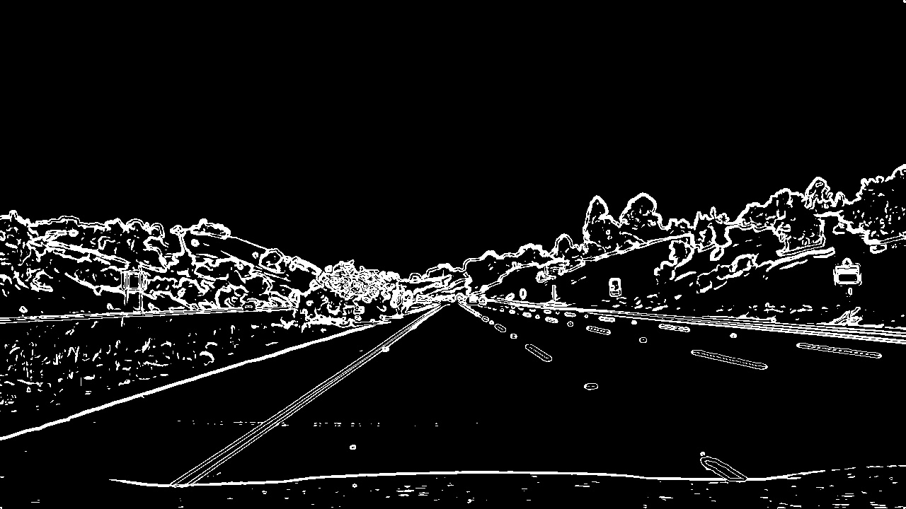

#### 2.1.2 Direction Threshold
The magnitude threshold is great for detecting edges in an image but also picks up many unwanted artifacts generated by street signs and other environmental objects. A feature we can use to assist us extracting the lane lines from an image is the direction of the gradient. Taking the arctan of the sobely and sobelx images generated from before, we can isolate gradients that match our criteria. For this project our direction threshold was between 0.7 and 1.3 which highlighted the lanes fairly well from the original image.

 
 
 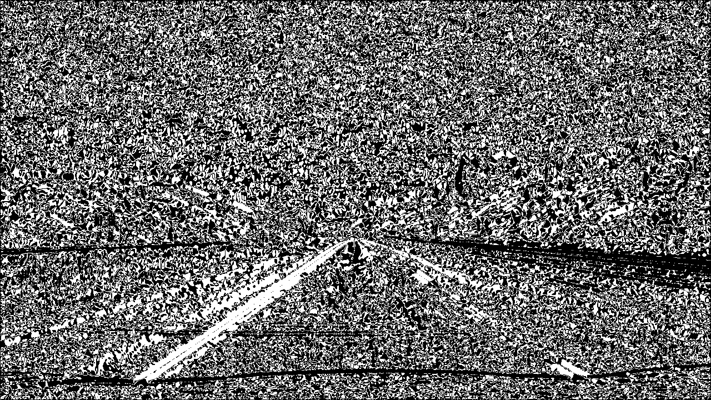

#### 2.1.2 Color Threshold
Aside from calculating the gradient of the image to determine the lane lines, we can also utilize additional color spaces to further assist our detection of the lane lines. Converting the original image in RGB space to HLS (hue, lightness, saturation) space using the 'cv2.cvtColor(img, cv2.COLOR_RGB2HLS)' function provides us with three unique images in a new color space. Applying a threshold on each image to extract the best version of the lane lines resulted in the following images: hue with threshold 15-30 (left), lightness with threshold 130-180 (middle), and saturation with threshold 180-255 (right).

 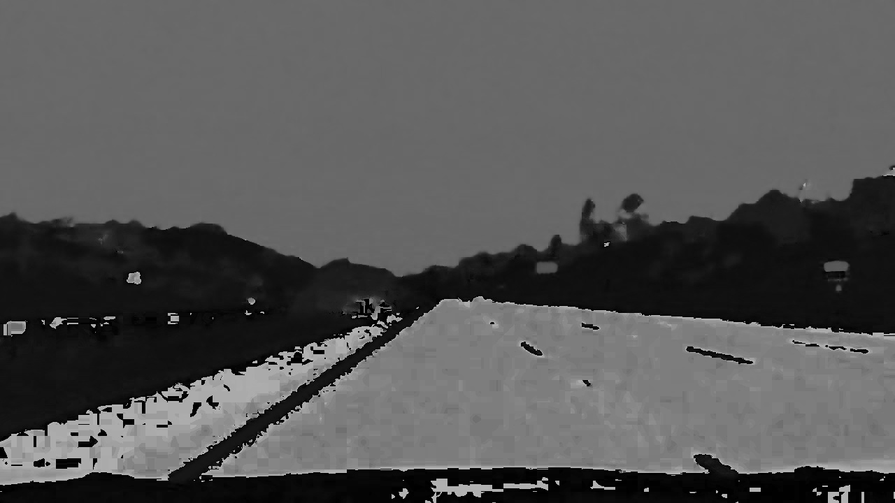
 
 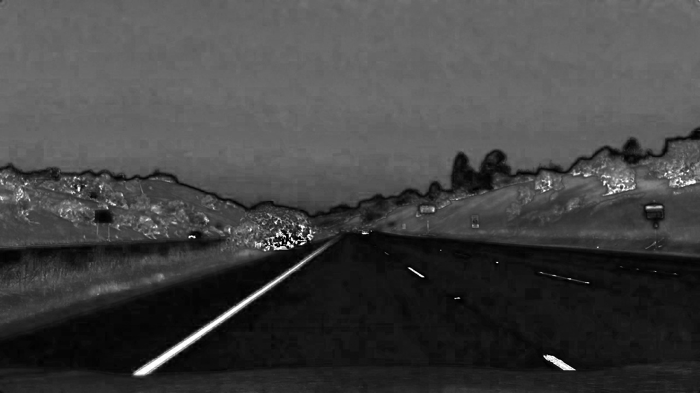

#### 2.1.3 Combine Thresholds
After computing all these images we can now combine them together to highlight the location of the lane lines since each method has its own unique strength in detecting the lines. With the binary images from the previous steps new binary images are created using the additive combination of sobelx and sobely with the additive combintion of the magnitude threshold (left) and direction threshold (middle) to generate a new combined binary image (right).

 
 
 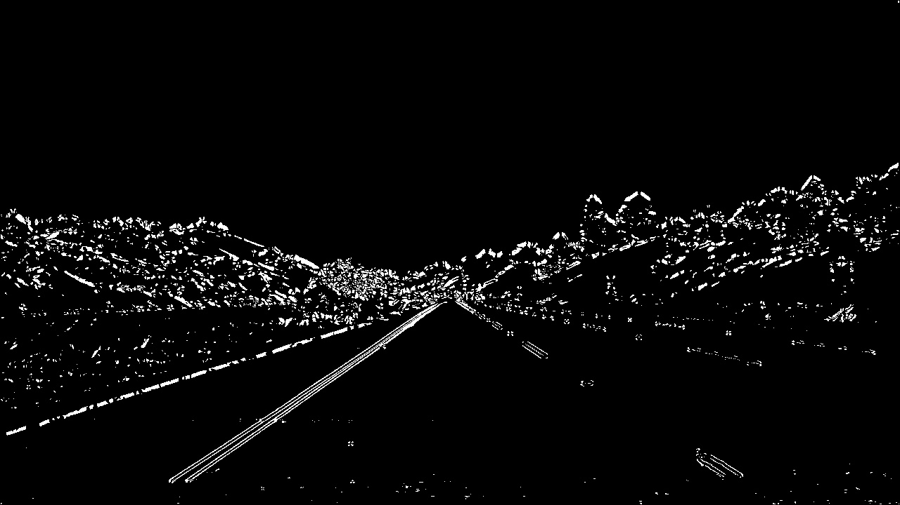

To further isolate the lane lines in the image from the background noise the new combined binary image (left) is then overlaid onto the saturation binary image (middle) to generate the final binary (right) which will be used to calculate the polynomial fit for the lane lines.

 
 
 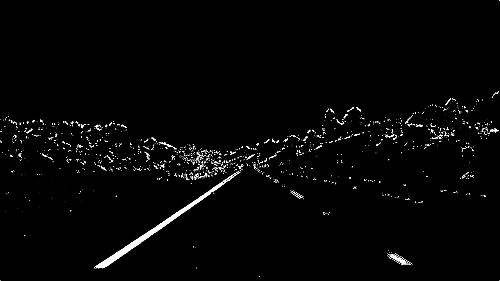

### 2.2 Detect Lane Lines
With the lane lines highlighed from the original image we now need to calculate the characteristics of each line such as slope and position. Before we can get any relevant data from the lines, we must first apply a perspective transform to the image to warped it to as if we were looking at the lane from the top down. For this step a four sided polygon was manually drawn on the original image (left) to define the lane (middle) so that a perspective transform could be applied to warp the image (right).

 
 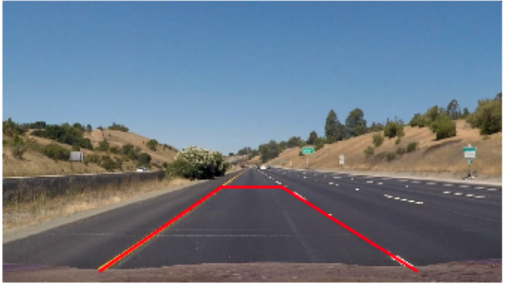
 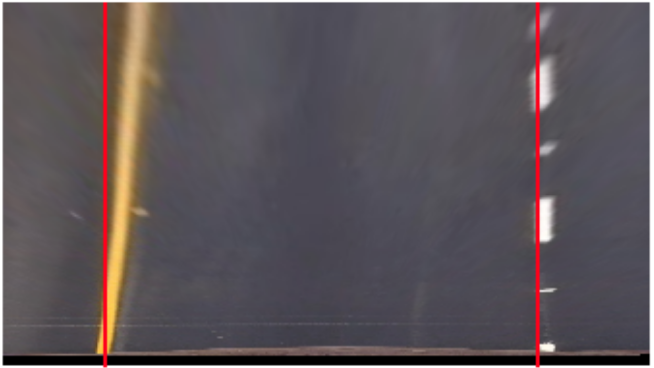

We can now plot the image as a histogram with respect to the concentration of points along the x-axis. Here two spikes can be seen that indicate the position of the left and right lane lines. The histogram is split into left and right sections from which the x position of the max value becomes the lane line center for computing the polynomial of the line. 

 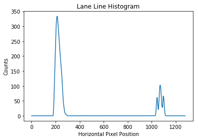

Now that we know the rough position of the lines in the image we begin classifying all the points that are most likely associated with the lane lines and not the surrounding environment. Using the sliding window method we can divide the image into horizontal slices and essentially trace the lane line vertically using a margin to search for points left and right of the center of the line previously detected. All the points detected were then used to calculate a polynomial fit for both lines and then the coefficients were added to the existing fit using a weighted average to smooth the detection method between frames.

 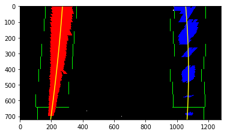

### 2.3 Determine Lane Curvature
The lane lines are calculated in the pixel space but we need to convert the dimensions to real space to have any significant value. Lanes are approximately 3.7 meters wide and 30.0 meters long on a straight section of road, so applying this scale to the image we can set the approximate conversion to be roughly 24 pixels/meter in the vertical and 346 pixels/meter in the horizontal. With this conversion we can convert the radius of curvature from pixel space to real space.

### 2.4 Unwarp Image & Overlay Lane
To augment the lane on image we use the polyfill function to fill in the space between the left and right lane polynomials (left) and then apply a perspective transform to unwarp the image (middle) back to the original frame of reference. The lane image is then overlaid onto the original image using a semi-transparent mask (right) to give the impression of a green shade to the predicted lane region.

 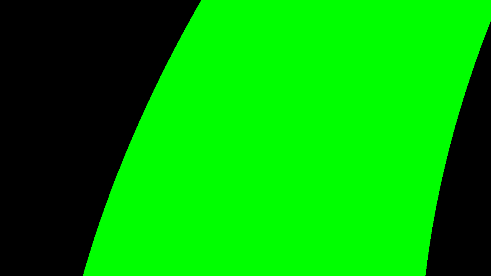
 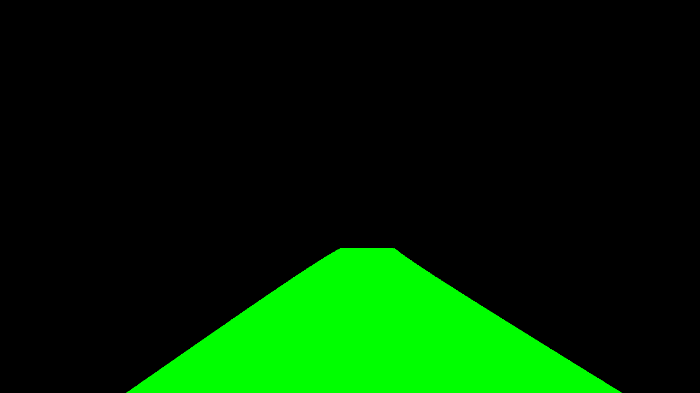
 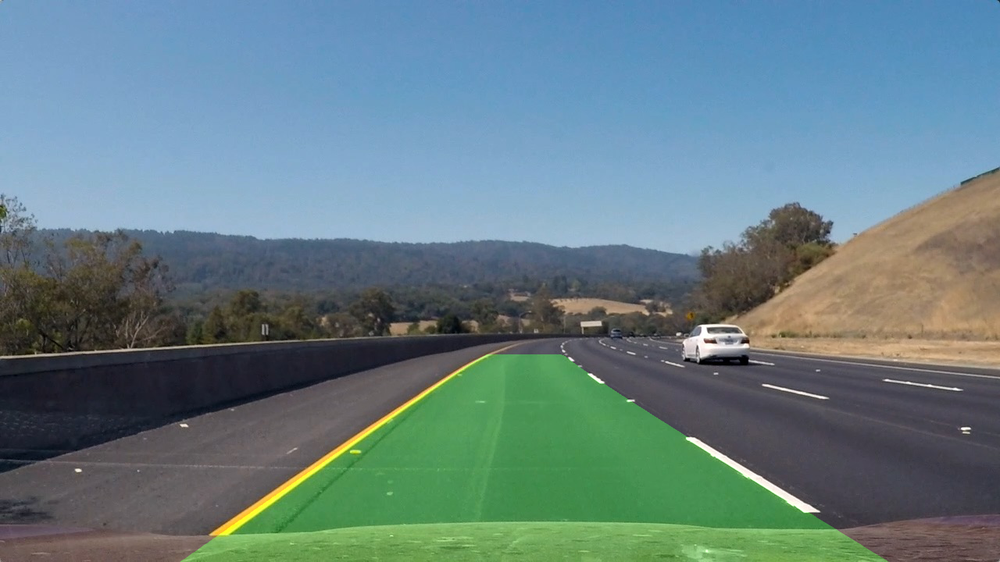

### 2.5 Annotate Image
Finally the radius of curvature and distance from center of the lane were displayed acrossed the top of the image using the 'cv2.putText()' function to apply an opaque mask to the image. To ensure the quality and repeatability of the lane detection process, all the images from the test_images folder were tested before moving onto creating a video.

 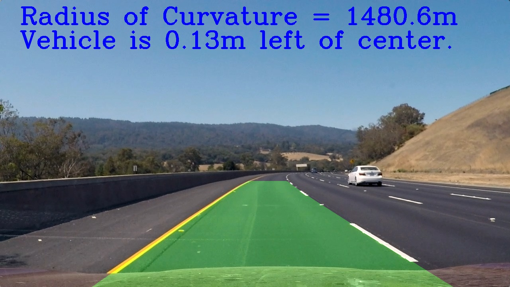
 
 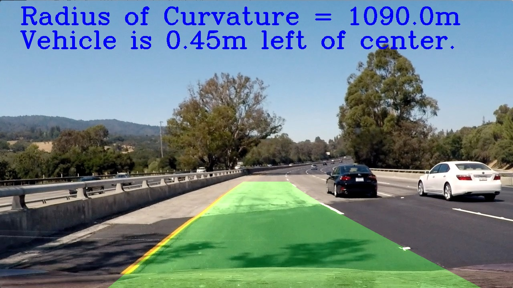
 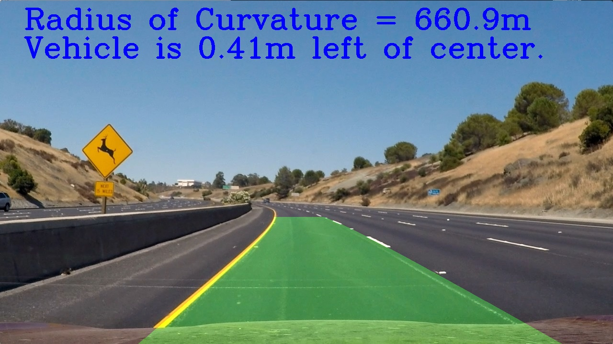
 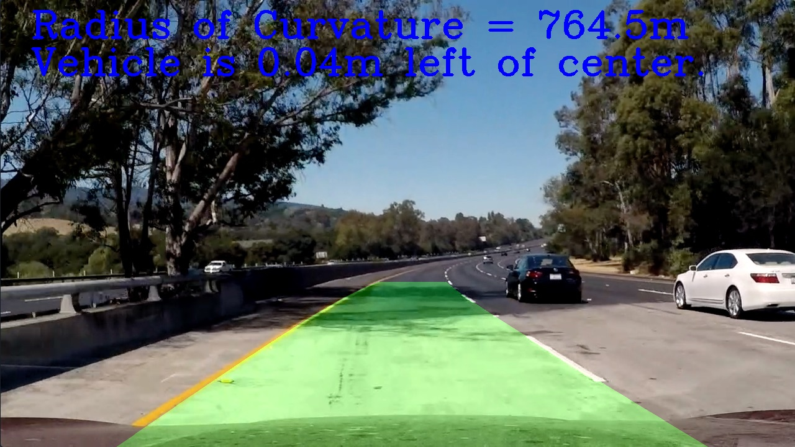
 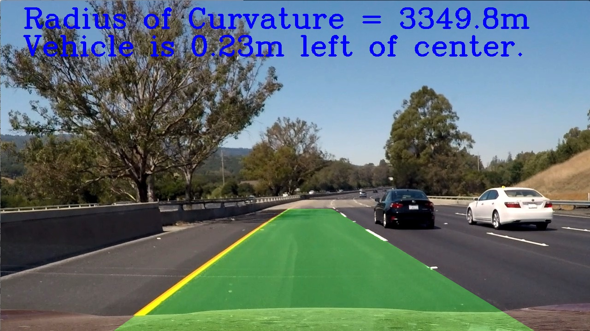

## 3. Pipeline (Video)
Now that the lanes can be detected consistently from individual images we can now apply it to a video. Here a weighted average is applied to the polynomial coefficients and lane line centers to effectively smooth the lane detection between frames and account for random noise in measurements. The final result is rather smooth and I am quite proud of how well this works. View the final video submission [HERE](./videos/submission.mp4).

 

## 4. Discussion

### 4.1 Briefly discuss any problems / issues you faced in your implementation of this project.  Where will your pipeline likely fail?  What could you do to make it more robust?

