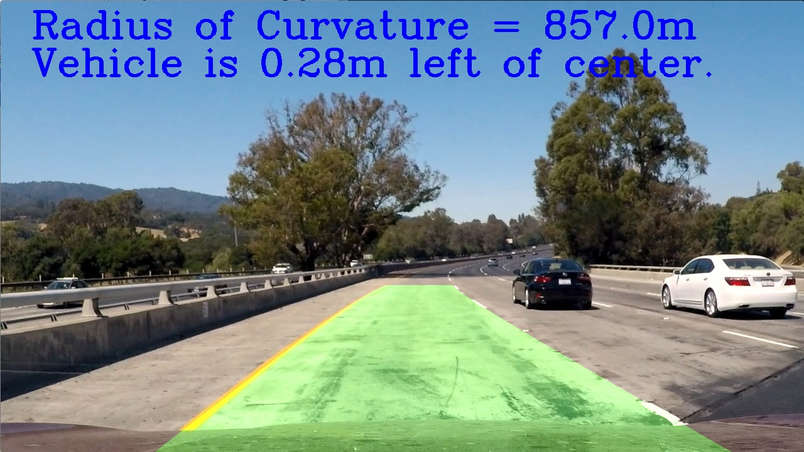

# Advanced Lane Finding

## 0. The Project

The goals / steps of this project are the following:

* Compute the camera calibration matrix and distortion coefficients given a set of chessboard images.
* Apply a distortion correction to raw images.
* Use color transforms, gradients, etc., to create a thresholded binary image.
* Apply a perspective transform to rectify binary image ("birds-eye view").
* Detect lane pixels and fit to find the lane boundary.
* Determine the curvature of the lane and vehicle position with respect to center.
* Warp the detected lane boundaries back onto the original image.
* Output visual display of the lane boundaries and numerical estimation of lane curvature and vehicle position.
* [Rubric](https://review.udacity.com/#!/rubrics/571/view) for the project.

## 1. Camera Calibration
The camera functionality was abstracted to a class to handle the calibration and perspective transformations of images for this project. For an overview of the code you can view it in main/camera.py. When the Camera class is instantiated the constructor loads a pre-determined image from the 'camera_cal' folder to load the distortion parameters for the camera. Since the camera parameters do not change between sessions, once they are calculated they are saved locally using a pickle database. However, if the database file is not present then all the images from the 'camera_cal' folder are loaded and run through th'cv2.findChessboardCorners()' function to characterize the lense distortion on the camera.

 
 

Once the corners of the chessboard have been determined, then the distortion on can be applied to an image using the OpenCV 'cv2.calibrateCamera()' function to calculate the parameters (ret, mtx, dist, rvecs, tvecs). The results are then saved using pickle. 

 
 

The camera class has two functions for applying perspective transforms to images to either warp or restore their original shape. These functions will be discussed later in this document.

## 2. Pipeline (Single Images)
The main pipeline for processing the images resides in the Lane class (main/lane.py) which was developed for managing the lane line and camera classes. To augment a lane onto an image, create an instance of class Lane() and pass an RGB image in as an argument to the process() function in the Lane class. This section will explain the steps in the process function.

### 2.1 Apply Thresholds

#### 2.1.1 Magnitude Threshold
Using the Sobel function from OpenCV the change in gradient in both the x and y axes produce binary images indicating the regions of strong gradients which is useful for identifying colored lane lines on a the road. To limit noise on for the Sobel function the RGB image is converted to grayscale and then the magnitude gradient is calculated from the x and y Sobel images by square rooting the sum of the squares of the images. 

 
 
 

#### 2.1.2 Direction Threshold
...

 
 
 

#### 2.1.2 Color Threshold
...

 
 
 

#### 2.1.3 Combine Thresholds
...

 
 
 

 
 
 

### 2.2 Detect Lane Lines
...

 
 
 

 

 

### 2.3 Determine Lane Curvature
...

### 2.4 Unwarp Image & Overlay Lane
...

 
 
 

### 2.5 Annotate Image
...

 
 
 
 
 
 

## 3. Pipeline (Video)
...

 

## 4. Discussion

### 4.1 Briefly discuss any problems / issues you faced in your implementation of this project.  Where will your pipeline likely fail?  What could you do to make it more robust?

